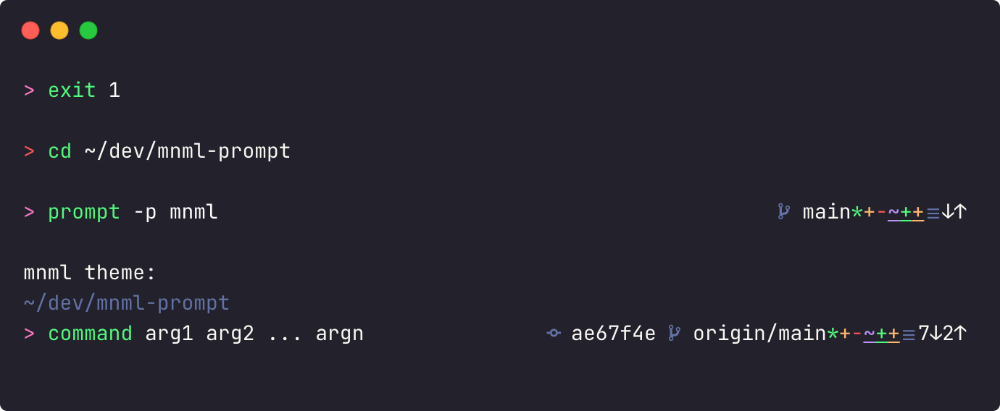

[][mnml]
 

[mnml] [prompt]
===============
A **m**i**n**i**m**a**l** [_Zsh_]ell [prompt theme].

\*Preview shows [_Dracula_ theme] with _[JetBrains Mono] [Nerd font]_.

Compatible with [.files].

Install
-------
with _[Home`brew`]_:
~~~ sh
brew install mnml-theme/install/mnml-prompt
~~~
or [`brew bundle`]` install`[` --file`] from _[Brewfile]_:
~~~ rb
tap  "mnml-theme/install"
brew "mnml-prompt"
~~~

Then add to your [startup files]:
~~~ sh
# ~/.zshrc
autoload -Uz promptinit
promptinit
prompt mnml
~~~
or simply [`export`] [`ZSH_THEME`] with [`ZDOTDIR`]:
~~~ sh
# $ZDOTDIR/source/*.env
ZSH_THEME=mnml
~~~

Configuration
------------------------------------------------------------------------------------------------------------------------------------------------------------------------------------
| [Environment variable][env]       | Default value               | Description                                                          |
|:----------------------------------|:----------------------------|:---------------------------------------------------------------------|
| [`PS1`][PS]/[`PROMPT`][PS]        | `ZSH_PROMPT_SYMBOL`         | Default left aligned prompt.                                         |
| [`RPS1`][PS]/[`RPROMPT`][PS]      | [`vcs_info`][vcs]           | Additional right aligned prompt.                                     |
| [`ZLE_RPROMPT_INDENT`]            | `0`                         | Number of spaces indentation to the right of `RPS1`/`RPROMPT`.       |
| `ZSH_PROMPT_NEWLINE`              | `true`                      | Add a newline after each command.                                    |
| `ZSH_PROMPT_SYMBOL_COLOR`         | `default`                   | _[ANSI]_ [`color`] of `ZSH_PROMPT_SYMBOL`.                           |
| `ZSH_PROMPT_COLOR_ERROR`          | `red`                       | ANSI `color` of `ZSH_PROMPT_SYMBOL_ERROR`.                           |
| `ZSH_PROMPT_COLOR_COMMENT`        | `8`                         | ANSI bright black by default.                                        |
| `ZSH_PROMPT_COLOR_JOBS`           | `ZSH_PROMPT_COLOR_COMMENT`  | ANSI `color` of `ZSH_PROMPT_SYMBOL_JOBS`.                            |
| `ZSH_PROMPT_COLOR_PWD`            | `ZSH_PROMPT_COLOR_COMMENT`  | ANSI `color` of `ZSH_PROMPT_PWD`.                                    |
| `ZSH_PROMPT_COLOR_ADDED`          | `green`                     | ANSI `color` of `ZSH_PROMPT_SYMBOL_ADDED` in `vcs_info`              |
| `ZSH_PROMPT_COLOR_UNTRACKED`      | `ZSH_PROMPT_COLOR_ADDED`    | ANSI `color` of `ZSH_PROMPT_SYMBOL_UNTRACKED` in `vcs_info`.         |
| `ZSH_PROMPT_COLOR_MODIFIED`       | `yellow`                    | ANSI `color` of `ZSH_PROMPT_SYMBOL_MODIFIED` in `vcs_info`.          |
| `ZSH_PROMPT_COLOR_RENAMED`        | `blue`                      | ANSI `color` of `ZSH_PROMPT_SYMBOL_RENAMED` in `vcs_info`.           |
| `ZSH_PROMPT_COLOR_DELETED`        | `ZSH_PROMPT_COLOR_ERROR`    | ANSI `color` of `ZSH_PROMPT_SYMBOL_DELETED` in `vcs_info`.           |
| `ZSH_PROMPT_COLOR_STASHED`        | `ZSH_PROMPT_COLOR_JOBS`     | ANSI `color` of `ZSH_PROMPT_SYMBOL_STASHED` in `vcs_info`.           |
| `ZSH_PROMPT_COLOR_REVISION`       | `ZSH_PROMPT_COLOR_STASHED`  | ANSI `color` of `ZSH_PROMPT_SYMBOL_REVISION` in `vcs_info`.          |
| `ZSH_PROMPT_COLOR_BRANCH`         | `ZSH_PROMPT_COLOR_REVISION` | ANSI `color` of `ZSH_PROMPT_SYMBOL_BRANCH` in `vcs_info`.            |
| `ZSH_PROMPT_SYMBOL`               | `>`                         | Main `PS1`/`PROMPT` symbol.                                          |
| `ZSH_PROMPT_SYMBOL_JOBS`          | `☰ `                        | Prefix `ZSH_PROMPT_SYMBOL` if any [jobs] running in the backround.   |
| `ZSH_PROMPT_SYMBOL_ERROR`         |                             | Prefix `ZSH_PROMPT_SYMBOL` if last command resulted in an error.     |
| `ZSH_PROMPT_SYMBOL_REVISION`      | ` `                        | Prefix `ZSH_PROMPT_REVISION` with [`commit` symbol]                  |
| `ZSH_PROMPT_SYMBOL_BRANCH`        | ` `                        | Prefix `vcs_info` with [`branch` symbol].                            |
| `ZSH_PROMPT_SYMBOL_UNTRACKED`     | `*`                         | Display if any [untracked] changes in `vcs_info`.                    |
| `ZSH_PROMPT_SYMBOL_ADDED`         | `+`                         | Display if any [`add`]ed changes in `vcs_info`.                      |
| `ZSH_PROMPT_SYMBOL_RENAMED`       | `~`                         | Display if any [renamed] changes in `vcs_info`.                      |
| `ZSH_PROMPT_SYMBOL_MODIFIED`      | `ZSH_PROMPT_SYMBOL_ADDED`   | Display if any [modified][untracked] changes in `vcs_info`.          |
| `ZSH_PROMPT_SYMBOL_DELETED`       | `-`                         | Display if any [deleted][untracked] changes in `vcs_info`.           |
| `ZSH_PROMPT_SYMBOL_STASHED`       | `ZSH_PROMPT_SYMBOL_JOBS`    | Display if any [`stash`]es in `vcs_info`.                            |
| `ZSH_PROMPT_SYMBOL_FETCH`         |                             | Prefix [`remote`] `vcs_info` with [`fetch`] symbol, such as [sync].  |
| `ZSH_PROMPT_SYMBOL_BEHIND`        | `↓`                         | Display if any [`commit`]s behind the `remote` in `vcs_info`         |
| `ZSH_PROMPT_SYMBOL_AHEAD`         | `↑`                         | Display if any `commit`s ahead of the `remote` in `vcs_info`.        |
| `ZSH_PROMPT_SYMBOL_FORMAT_PREFIX` |                             | Prefix `ZSH_PROMPT_FORMAT` with symbol, such as `[`.                 |
| `ZSH_PROMPT_SYMBOL_FORMAT_SUFFIX` |                             | Append `ZSH_PROMPT_FORMAT` with symbol, such as `]`.                 |
| `ZSH_PROMPT_FORMAT`               | `%b%u%c%m`                  | Format of [`vcs_info`][vcs]. See [below table] for reference.        |
| `ZSH_PROMPT_PWD`                  | false                       | Display the **P**resent **W**orking **D**irectory ([`PWD`][env]).    |
| `ZSH_PROMPT_COUNT_JOBS`           | false                       | Display number of [jobs] running in the background.                  |
| `ZSH_PROMPT_REVISION`             | false                       | Display latest `commit` [revision] hash in `vcs_info`.               |
| `ZSH_PROMPT_REMOTE`               | false                       | Display `remote` [`branch`] in `vcs_info`.                           |
| `ZSH_PROMPT_COUNT_FETCH`          | `true`                      | Display number of `commit`s ahead/behind the `remote` in `vcs_info`. |
| `ZSH_PROMPT_COUNT_STASHED`        | false                       | Display number of `stash`es in `vcs_info`.                           |
| `ZSH_PROMPT_COUNT_CHANGED`        | false                       | Prefix each change in `vcs_info` with number files changed.          |

[`vcs_info`][vcs] reference:
--------------------------------
| `formats` | info             |
|:----------|:-----------------|
| `%b`      | [`branch`]       |
| `%u`      | **u**n[`stage`]d |
| `%c`      | `stage`d         |
| `%m`      | [`stash`]ed      |
| `%7.7i`   | [Revision]       |

License
-------
[MIT] © [Daniel Bayley]

[MIT]:                              LICENSE.md
[Daniel Bayley]:                    https://github.com/danielbayley

[mnml]:                             https://github.com/mnml-theme

[_Dracula_ theme]:                  https://draculatheme.com/terminal
[JetBrains Mono]:                   https://jetbrains.com/lp/mono
[nerd font]:                        https://github.com/ryanoasis/nerd-fonts/tree/master/patched-fonts/JetBrainsMono

[home`brew`]:                       https://brew.sh
[`brew bundle`]:                    https://docs.brew.sh/Manpage#bundle-subcommand
[brewfile]:                         https://github.com/Homebrew/homebrew-bundle#usage
[.files]:                           https://github.com/danielbayley/homebrew-dotfiles#readme

[_zsh_]:                            https://zsh-manual.netlify.app/introduction
[`ZDOTDIR`]:                        https://github.com/danielbayley/zdotdir#readme
[startup files]:                    https://zsh-manual.netlify.app/files?highlight=%24ZDOTDIR%2F.zshrc#51-startupshutdown-files
[`export`]:                         https://zsh-manual.netlify.app/options?highlight=all_export#1625-initialisation
[prompt]:                           https://en.wikipedia.org/wiki/Command-line_interface#Command_prompt
[prompt theme]:                     https://zsh-manual.netlify.app/user-contributions#Prompt-Themes
[ANSI]:                             https://en.wikipedia.org/wiki/ANSI_escape_code
[`color`]:                          https://zsh-manual.netlify.app/user-contributions#26121-descriptions
[env]:                              https://zsh-manual.netlify.app/parameters?highlight=environment%20variables#151-description
[PS]:                               https://zsh-manual.netlify.app/parameters?highlight=PROMPT#156-parameters-used-by-the-shell
[jobs]:                             https://zsh-manual.netlify.app/jobs-&-signals#101-jobs

[`ZLE_RPROMPT_INDENT`]:             https://zsh-manual.netlify.app/parameters?highlight=ZLE_RPROMPT_INDENT#156-parameters-used-by-the-shell
[`ZSH_THEME`]:                      https://github.com/ohmyzsh/ohmyzsh/wiki/Settings#zsh_theme

[vcs]:                              https://zsh-manual.netlify.app/user-contributions#2657-hooks-in-vcs_info
[below table]:                      #vcs_info-reference
[revision]:                         https://git-scm.com/book/en/v2/Git-Tools-Revision-Selection
[untracked]:                        https://git-scm.com/book/en/Git-Basics-Recording-Changes-to-the-Repository
[`branch`]:                         https://git-scm.com/docs/git-branch
[`commit`]:                         https://git-scm.com/docs/git-commit
[`add`]:                            https://git-scm.com/docs/git-add
[`stage`]:                          https://git-scm.com/docs/git-stage
[renamed]:                          https://git-scm.com/docs/git-mv
[`stash`]:                          https://git-scm.com/docs/git-stash
[`remote`]:                         https://git-scm.com/docs/git-remote
[`fetch`]:                          https://git-scm.com/docs/git-fetch
[`commit` symbol]:                  https://primer.style/octicons/git-commit-16
[`branch` symbol]:                  https://primer.style/octicons/git-branch-16
[sync]:                             https://primer.style/octicons/sync-16
